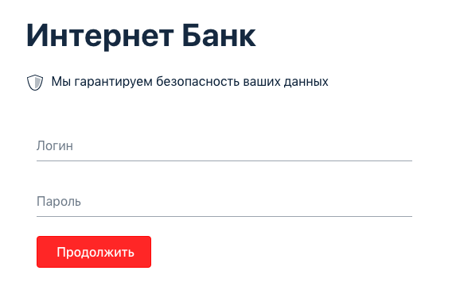
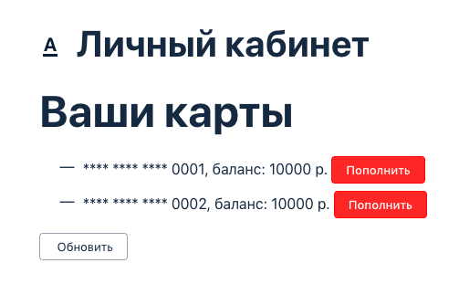

___

#### Тестирование функции перевода с карты на карту

---
* Создать папку, открыть терминал по адресу папки и инициализировать систему Git `git init`
* Склонировать репозиторий `git clone https://github.com/AlexanderKachalov/BehaviourDrivenDevelopment.git`
* Перейти в директорию artifacts `cd artifacts` и выполнить команду `java -jar app-ibank-build-for-testers.jar`
* Форма для тестирования находится по адресу `localhost:9999`
* Вернуться в директорию с проектом `cd /BehaviourDrivenDevelopment`
* Выполнить команду `./gradlew test` (`./gradlew.bat test` для Windows)
* Отчет о выполнении тестов в директории `build/reports/tests/test`
---
* тестируемые формы:
---

---

---

---

---

---